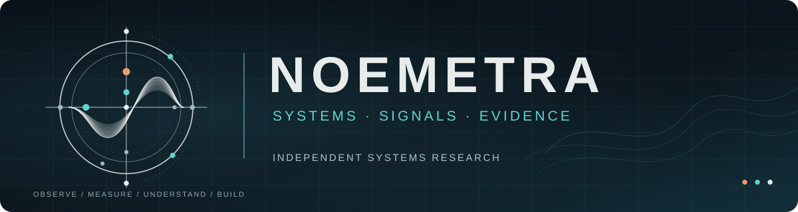
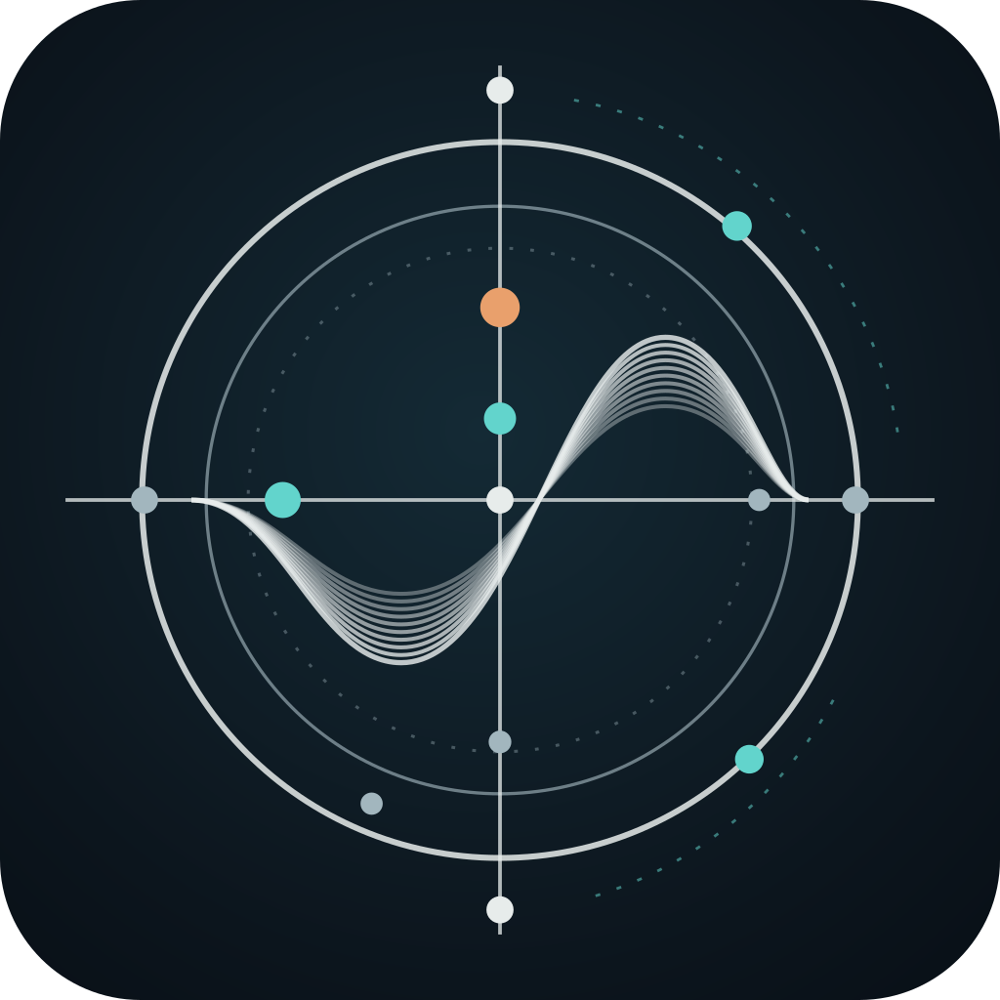
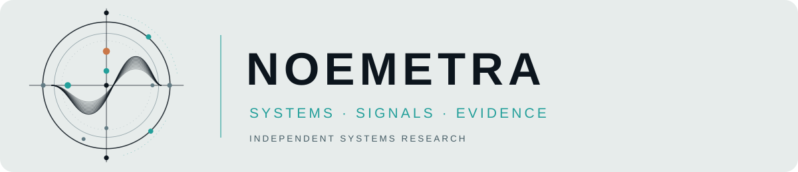

# NOEMETRA identity system

**Systems · Signals · Evidence**

Independent Systems Research.

This is a research-workspace identity, not a company-certification claim or a statement that every experiment is production ready. The name **NOEMETRA** is a coined combination inspired by thought (*noema*) and measurement; it is an identity concept, not a scientific terminology claim.

## Primary marks

| Asset | Purpose |
| --- | --- |
| [`../profile/header.svg`](../profile/header.svg) | GitHub organization README banner; landscape 1200 × 320 |
| [`avatar.svg`](avatar.svg) | Master square symbol for account/avatar use; 1024 × 1024 SVG canvas |
| [`mark.svg`](mark.svg) | Transparent, standalone 400 × 400 measurement emblem |
| [`lockup-light.svg`](lockup-light.svg) | Full wordmark/descriptor on light backgrounds; 1200 × 260 |

### Banner

### Avatar

### Light lockup

## Symbol rationale

The **orbit** marks a bounded observation field; the **axes** represent measurement, the overlapping **waveforms** represent signals and competing readings, and the **colored nodes** mark observable reference points. The symbol is deliberately *not* a shield, keyhole, fingerprint or lock.

The mark does not claim omniscience or complete coverage: it represents an instrument and a research approach.

## Colors

| Role | Color | Hex |
| --- | --- | --- |
| Deep charcoal / primary surface | Dark | `#0C151D` |
| Cold ivory / readable text | Light | `#E7ECEB` |
| Glacial teal / signal mark | Accent | `#62D4CC` |
| Muted orange / selected observation | Secondary accent | `#E9A06C` |
| Supporting gray-blue | Secondary type | `#A2B6BE` |

Keep backgrounds dark or cold ivory; use teal primarily for signal markings and orange sparingly for observed focal points. Don't use the accent colors as a substitute for text contrast or as an implication that a security finding is verified.

## Type and content

- **Wordmark:** uppercase, precise tracking, neutral sans-serif letterforms (no licensed font files).
- **Data and experiment labels:** restrained monospaced text when relevant.
- **Primary descriptor:** `Independent Systems Research`.
- **Core triad:** `Systems · Signals · Evidence`.
- **Method line:** `Build the mechanism. Measure the outcome. Preserve the uncertainty.`

Start with the **software and capability**, follow with the experimental setup and evidence, then state boundaries. Avoid inflated words such as “untraceable”, “unbreakable”, “100% secure” or “automated attribution” unless independently justified.

## Organization migration

The current GitHub namespace remains `Northguard-Security` until the account owner changes it. The public identity is NOEMETRA, and the repository URLs intentionally stay functional during this transition. See [`MIGRATION.md`](MIGRATION.md) for required steps.

**Name-clearance status:** preliminary exact-name web and GitHub-repository searches did not reveal a clear conflicting use as of October 8, 2026. This is **not** trademark, company-register, domain-ownership, or GitHub-handle clearance; complete those checks before using the name commercially or renaming the organization URL.
